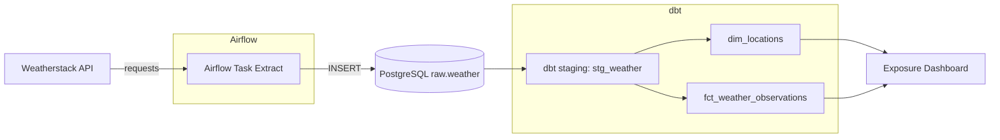

<div align="center">

# WeatherStack ETL & Analytics

Pipeline de démonstration : API Weatherstack → PostgreSQL (raw) → dbt (staging, marts) orchestré par Airflow.


</div>

## 1. Objectifs
Illustrer un mini data stack reproductible : ingestion API, modélisation analytique, qualité et documentation.

## 2. Stack
| Composant | Rôle | Remarques |
|-----------|------|-----------|
| PostgreSQL | Stockage brut + transformé | Schémas: raw, staging, marts |
| Airflow | Orchestration des tâches | DAGs ETL + dbt + docs |
| dbt | Modélisation & tests | `dbt_utils` utilisé |
| (Optionnel) `dbt-cli` | Workspace analytique interactif | Supprimable en prod |

### Modes d'exécution
| Mode | Services | Usage | Remarques |
|------|----------|-------|-----------|
| Développement | postgres, airflow-webserver, airflow-scheduler, dbt-cli | Itération rapide, tests manuels dbt | Confort prioritaire |
| Production-like | postgres, airflow-webserver, airflow-scheduler | Orchestration seule | Moins de surface, reproductible |
| CI | image buildée + commandes dbt | Validation automatique | Sans service dbt-cli |

## 3. Démarrage rapide
```bash
cp .env.example .env          # Variables d'environnement
python -c "from cryptography.fernet import Fernet;print(Fernet.generate_key().decode())"  # Générer une clé
# Ajouter la clé dans .env (AIRFLOW__CORE__FERNET_KEY)
docker compose up -d --build
```
UI Airflow: http://localhost:8080 (admin / admin si non modifié).

## 4. DAG principal
Un seul DAG volontairement conservé pour rester minimaliste et lisible :

| DAG | Rôle | Fréquence | Étapes |
|-----|------|-----------|--------|
| weatherstack_full_pipeline | Extraction API → raw + transformations dbt (staging & marts) + tests + docs | Daily | create_table → extract_load → dbt_staging → dbt_tests → dbt_marts → dbt_tests_marts → dbt_docs |

> Choix pédagogique : moins de DAGs = compréhension plus rapide du flux complet.

## 5. Flux de données (Bronze → Silver → Gold)
1. Extraction API → insertion JSON + champs extraits dans `raw.weather`.
2. Vue `stg_weather` (normalisation + catégorisation).
3. `dim_locations` & `fct_weather_observations` pour analyses.
4. Tests dbt (à enrichir) + génération documentation.

### Diagramme (vue haute niveau)


## 6. Commandes dbt usuelles
```bash
dbt run --select staging
dbt test --select staging
dbt run --select marts
dbt test --select marts
dbt docs generate
```

## 7. Optimisation docker-compose
Architecture actuelle (après refactor) :
* `airflow-webserver` : UI + API
* `airflow-scheduler` : planification des DAGs
* `dbt-cli` (optionnel) : workspace pour exécuter `dbt run`, `dbt build`, `dbt docs serve`
* `postgres`

Simplifications possibles:
1. Supprimer le service `dbt` si tu exécutes dbt via Airflow uniquement.
2. Construire une image Airflow custom (voir `Dockerfile.airflow`) au lieu du long `command:`.
3. Séparer webserver & scheduler (production) :
```yaml
	airflow-webserver:
		build:
			context: .
			dockerfile: Dockerfile.airflow
		command: airflow webserver
	airflow-scheduler:
		build:
			context: .
			dockerfile: Dockerfile.airflow
		command: airflow scheduler
		depends_on: [postgres, airflow-webserver]
```
4. Ajouter des `healthcheck` :
```yaml
healthcheck:
	test: ["CMD", "airflow", "users", "list"]
	interval: 30s
	timeout: 10s
	retries: 5
```
5. Éviter de passer en clair le mot de passe admin (créer l'utilisateur manuellement la première fois ou script dédié).

## 8. Dockerfile Airflow optimisé (ce que ça change)
Sans Dockerfile: chaque démarrage = installation lente de `dbt-postgres`.
Avec `Dockerfile.airflow`: dépendances figées lors du build → démarrage rapide, reproductible, moins d'erreurs réseau.

Contenu clé : installation unique de `dbt-postgres`, centralisation des requirements et séparation webserver / scheduler via docker-compose.

## 9. Roadmap courte (orientée apprentissage)
- [ ] Factoriser extraction (module `dags/utils/weather_api.py`).
- [ ] Ajouter un modèle d'agrégation journalière (`agg_daily_weather`).
- [ ] Ajouter dimension temps (calendar) pour futurs dashboards.
- [ ] Test d'acceptation température (déjà filtrée mais test dbt dédié).
- [ ] Logging structuré (remplacer print par logging Airflow).
- [ ] (Plus tard) Publier docs dbt via GitHub Pages.

## 9.1 Vision future Dashboard
Prévu: connecter un outil (Tableau / Power BI / Metabase) sur :
- `dim_locations` (géographie)
- `fct_weather_observations` (granularité fine)
- `agg_daily_weather` (à créer) pour courbes évolutives

Tu pourras aussi ajouter un nouveau `exposure` dbt spécifique au dashboard réel.

## 10. Variables d'environnement clés
| Nom | Rôle |
|-----|------|
| WEATHERSTACK_API_KEY | Clé d'API Weatherstack |
| AIRFLOW__CORE__FERNET_KEY | Chiffrement des connexions |
| DBT_POSTGRES_* | Paramètres connexion dbt |

### 10.1 Détails connexion dbt & fallback
Le profil `dbt` (`dbt/dbt_profiles.yml`) est paramétré avec des `env_var()` possédant maintenant des valeurs de repli :

| Variable dbt | Fallback (ordre) | Commentaire |
|--------------|------------------|-------------|
| DBT_POSTGRES_HOST | `postgres` | Nom du service Docker (DNS interne) |
| DBT_POSTGRES_PORT | `5432` | Port standard Postgres |
| DBT_POSTGRES_USER | `DBT_POSTGRES_USER` -> `POSTGRES_USER` -> `postgres` | Chaînage de secours |
| DBT_POSTGRES_PASSWORD | `DBT_POSTGRES_PASSWORD` -> `POSTGRES_PASSWORD` -> `postgres` | Pour environnement local uniquement |
| DBT_POSTGRES_DB | `DBT_POSTGRES_DB` -> `POSTGRES_DB` -> `postgres` | Base par défaut |

Exemple minimal `.env` :
```
POSTGRES_USER=postgres
POSTGRES_PASSWORD=postgres
POSTGRES_DB=postgres
WEATHERSTACK_API_KEY=VOTRE_CLE_API
WEATHERSTACK_BASE_URL=http://api.weatherstack.com/current
```

Relancer après modification :
```bash
docker compose up -d --force-recreate
```

Erreur fréquente (avant fallback) :
```
Parsing Error: Env var required but not provided: 'DBT_POSTGRES_HOST'
```
Solution : mettre à jour votre repo (pull) OU définir la variable dans `.env`.

## 11. Questions fréquentes
Q: Le service `dbt-cli` est-il obligatoire ?
A: Non. C'est un confort de développement (exploration, debug ciblé, docs locales). Les DAGs Airflow exécutent déjà dbt.

Q: Pourquoi stocker le JSON complet dans `raw_json` ?
A: Permet de rejouer des transformations si la logique évolue sans réappeler l'API.

Q: Dois-je créer les schémas (`raw`, `staging`, `marts`) ?
A: Oui idéalement via une tâche de préparation ou script init (ex: `CREATE SCHEMA IF NOT EXISTS raw;`).

## 12. Minimalisme assumé
Le projet évite volontairement :
- Multiplication de DAGs (lisibilité d'abord)
- Macros dbt prématurées (logique inline suffisante)
- Orchestrations avancées (pas encore de capteurs / SLA)
- Exécuteur distribué (Sequential suffit pour apprendre)

Quand tu seras à l'aise, tu pourras ajouter : Celery/Kubernetes Executor, tests plus poussés, freshness checks, CI complète.

## 13. Troubleshooting rapide
| Problème | Piste |
|----------|-------|
| Airflow ne démarre pas | Vérifier clé Fernet & droits volumes |
| dbt ne trouve pas le profil | Vérifier montage `profiles.yml` & variables env |
| Aucune donnée insérée | Vérifier `WEATHERSTACK_API_KEY` valide |

## 14. Licence / Usage
Projet pédagogique / expérimentation. Adapter avant usage production.

---
Besoin d'aide pour un point spécifique (CI, refactor DAG, tests dbt) ? Ouvre une issue ou demande directement.
